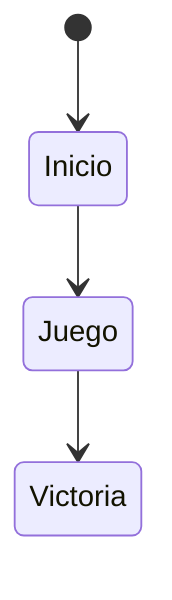
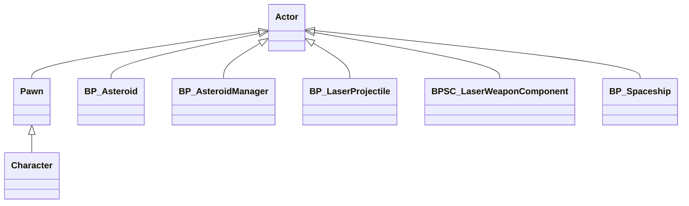

# Space-Base

Se trata de un pequeño videojuego sin sonorizar que puede servir como punto de partida para una práctica de integración de FMOD, diseño de sonido y composición sonora. En él manejamos una nave espacial que se tiene que desplazar y disparar asteroides hasta destruir suficientes como para ganar la partida.

El índice de la documentación es el siguiente:
* [Autoría y licencia](#autoría-y-licencia)
* [Instalación y uso](#instalación-y-uso)
* [Mecánica](#mecánica)
* [Dinámica](#dinámica)
* [Estética](#estética)
* [Contenido](#contenido)
* [Implementación](#implementacion)

## Autoría y licencia
Pablo Rodríguez-Tembleco y Federico Peinado son los responsables de esta versión de marzo de 2025 (Unreal Engine 5.5), una leve modificación de un proyecto original [ImplemenTournament](https://max-koko.itch.io/implementournament) de Jon Kelliher y Avishai, desarrollado en septiembre de 2024 (Unreal Engine 5.3) para la comunidad de [AirWiggles](https://www.airwiggles.com/), con ayuda de Greg Lester y Lewis Thompson.
El proyecto originar servía para que los participantes del torneo ImplemenTournament creasen efectos sonoros interactivos en FMOD y los integrasen en el juego, y es algo similar lo que propondremos a los alumnos del [Máster en Tecnologías en la Composición de Bandas Sonoras y Música para Videojuegos](https://www.ucm-musica-audiovisual.com/) de la UCM.

El código de nuestra parte se distribuye con licencia LGPL.

## Instalación y uso
Todos los ficheros importantes del proyecto están disponible en este repositorio, ya que NO se ha optado porque haya binarios potencialmente grandes en el almacén GitHub LFS ni por exigir tener activa la extensión Git LFS;
tampoco hay ficheros de contenido más pesado, común a varios proyectos o con licencia de terceros que tengan que descargarse de carpetas compartidas en Google Drive.

## Mecánica
Como parte del diseño de jugabilidad tenemos las siguientes mecánicas:
* Aceleración - La nave puede avanzar a velocidad normal, mostrando los propulsores activos; en inglés lo han llamado Thrust.
* Disparo - La nave puede dispadar rayos láser que salen de ambos costados a la vez y puedes destruir asteroides tras varios impactos.
* Hiperimpulso - La nave avanza muy rápido, con un efecto visual de difuminado de las estrellas; en inglés lo han llamado Boost.
* Movimiento 2D - La nave -vista en tercera persona por detrás- se puede mover hacia arriba, hacia abajo, a la izquierda o a la derecha, siendo estos los dos ejes de la pantalla.

Concretamente los controles del jugador para el teclado son estos (aunque también hay posibilidad de usar un gamepad):
* Barra espaciadora - Aceleración 
* Botón izquierdo del ratón - Disparo
* Tecla Shift - Hiperimpulso 
* Teclas W, A, S y D - Movimiento 2D

## Dinámica
El objetivo del juego es destruir 10 asteroides. El sistema lleva la cuenta de los que destruyas y muestra un mensaje cuando lo haces.
Apenas hay dinámicas de juego establecida, con conflictos como un límite de tiempo o unos enemigos... tal sólo tienes que conseguir el objetivo a tu ritmo.

El bucle de juego es obvio:

## Estética
La idea es que sientas ser el dueño de una nave que avanza por el espacio y destruye unos asteroides inmóviles que aparecen aleatoriamente a lo largo de tu camino, con lo que no es un juego espacialmente emocionante aunque está correctamente realizado.
El aspecto visual es bastante cartoon, con buenos modelos 3D y efectos de partículas bastantes creíbles, pero como dijimos antes no hay música ni sonido alguno.

## Contenido
Sólo hay un escenario donde vemos un gran planeta azul y las estrellas. Los únicos habitantes son el vehículo de la nave espacial controlado por el jugador (el avatar) y los asteroides estáticos (las dianas... más que enemigos). No hay más objetos, potenciadores o armas que poder utilizar, salvo las que lleva ya integradas la nave. 

## Implementación
Las clases principales que se han desarrollados son las siguientes.

Falta entrar en detalle sobre cómo es el nivel y la organización de actores en él. Y falta detallar todo el gameplay framework a nivel de Blueprints.

## Referencias
Lista de referencias utilizadas en este proyecto:

* Max Koko. [Airwiggles ImplemenTournament Maksym Kokoiev](https://max-koko.itch.io/implementournament). Itch.io (2024)
