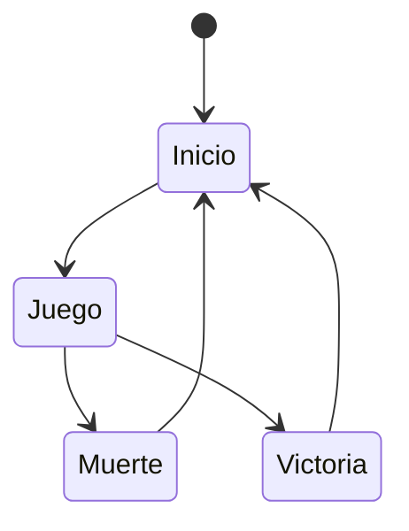
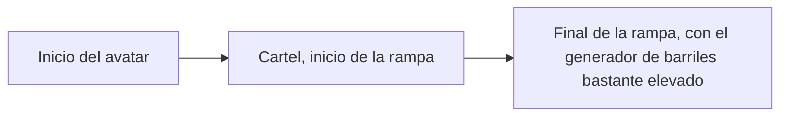
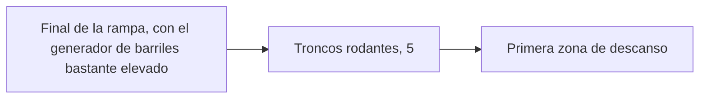
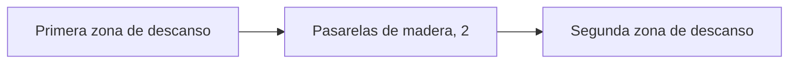
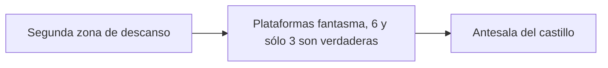
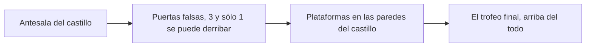
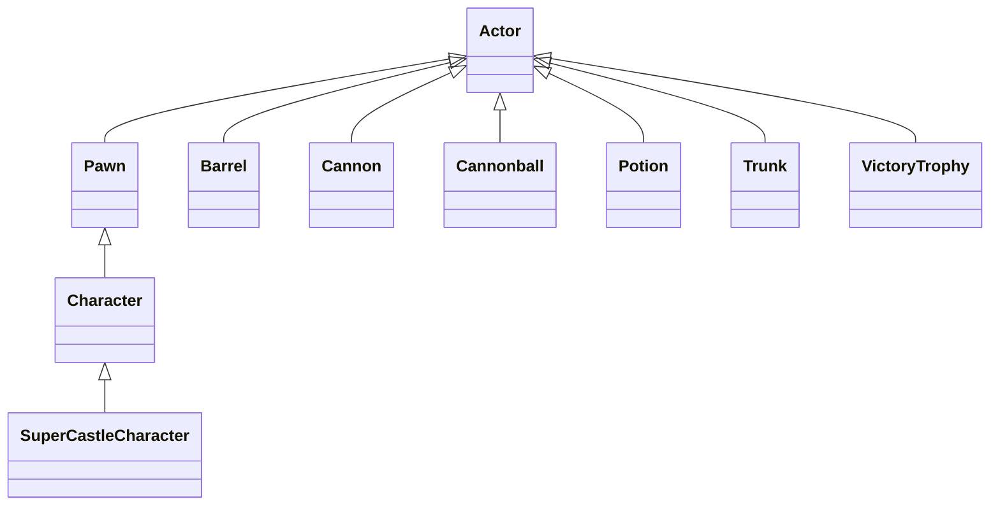

# Space - Base

Se trata de un pequeño videojuego sin sonorizar que puede servir como punto de partida para una práctica de integración de FMOD, diseño de sonido y composición sonora. En él manejamos una nave espacial que se tiene que desplazar y disparar asteroides hasta destruir suficientes como para ganar la partida.

El índice de la documentación es el siguiente:
* [Autoría y licencia](#Autoría)
* [Instalación y uso](#Instalación)
* [Mecánica](#Mecánica)

* Mecánica

## Autoría y licencia
Pablo Rodríguez-Tembleco y Federico Peinado son los responsables de esta versión de marzo de 2025 (Unreal Engine 5.5), una leve modificación de un proyecto original [ImplemenTournament](https://max-koko.itch.io/implementournament) de Jon Kelliher y Avishai, desarrollado en septiembre de 2024 (Unreal Engine 5.3) para la comunidad de [AirWiggles](https://www.airwiggles.com/), con ayuda de Greg Lester y Lewis Thompson.
El proyecto originar servía para que los participantes del torneo ImplemenTournament creasen efectos sonoros interactivos en FMOD y los integrasen en el juego, y es algo similar lo que propondremos a los alumnos del [Máster en Tecnologías en la Composición de Bandas Sonoras y Música para Videojuegos](https://www.ucm-musica-audiovisual.com/) de la UCM.

El código de nuestra parte se distribuye con licencia LGPL.

## Instalación y uso
Todos los ficheros importantes del proyecto están disponible en este repositorio, ya que NO se ha optado porque haya binarios potencialmente grandes en el almacén GitHub LFS ni por exigir tener activa la extensión Git LFS;
tampoco hay ficheros de contenido más pesado, común a varios proyectos o con licencia de terceros que tengan que descargarse de carpetas compartidas en Google Drive.

## Mecánica

Como parte del diseño de jugabilidad tenemos las siguientes mecánicas:
* Aceleración - La nave puede avanzar a velocidad normal, mostrando los propulsores activos; en inglés lo han llamado Thrust.
* Disparo - La nave puede dispadar rayos láser que salen de ambos costados a la vez y puedes destruir asteroides tras varios impactos.
* Hiperimpulso - La nave avanza muy rápido, con un efecto visual de difuminado de las estrellas; en inglés lo han llamado Boost.
* Movimiento 2D - La nave -vista en tercera persona por detrás- se puede mover hacia arriba, hacia abajo, a la izquierda o a la derecha, siendo estos los dos ejes de la pantalla.

Concretamente los controles del jugador para el teclado son estos (aunque también hay posibilidad de usar un gamepad):
* Barra espaciadora - Aceleración 
* Botón izquierdo del ratón - Disparo
* Tecla Shift - Hiperimpulso 
* Teclas W, A, S y D - Movimiento 2D

## Dinámica

El objetivo del juego es destruir 10 asteroides. El sistema lleva la cuenta de los que destruyas y muestra un mensaje cuando lo haces.
Apenas hay dinámicas de juego establecida, como límites de tiempo o enemigos... tal sólo tienes que conseguir el objetivo como prefieras hacerlo.

## Estética

La idea es que sientas ser el dueño de una nave que avanza por el espacio y destruye unos asteroides inmóviles que aparecen aleatoriamente a lo largo de tu camino, con lo que no es un juego espacialmente emocionante aunque está correctamente realizado.
El aspecto visual es bastante cartoon, con buenos modelos 3D y efectos de partículas bastantes creíbles, pero como dijimos antes no hay música ni sonido alguno.

 

#### Objetivo
El objetivo del juego es pasar por todas las pruebas hasta conseguir el trofeso que se encuentra en lo más alto del castillo.

#### Castigo
El jugador solo puede morir en el caso de ser golpeado por barriles o balas de cañon. Cuando esto pase, volverá al
inicio del nivel. En el caso de caer al foso, se le ha proporcionado unas rampas para volver al principio de la prueba
en la que se ha caido, con lo que es un castigo mucho más leve.

### Contenido
A continuación detallamos el contenido más importante del juego.

#### Avatar
El clásico maniquí de Unreal Engine que se puede mover y saltar es el avatar que controla el jugador.

#### Pociones
Hay dos tipos y solo podremos coger una de cada. Lo bueno es que el efecto que tienen sobre el jugador no desaparece en toda la partida.

- **Poción de velocidad**. Es de color amarillo y permite que el avatar duplique su velocidad al cogerla. 
- **Pocion de salto**. Es de color amarillo y permite que el avatar multiplique por 1.5 su impulso al saltar.

#### Barriles

Los barriles son cilindros de varios tamaños que caen por la rampa que pertenecen a la Zona 1 y se generan de forma aleatoria en lo alto de la rampa. Si el avatar es golpeado por un barril, este se destruye pero el avatar se queda como un muñeco de trapo y se recarga el nivel desde el principio. 

#### Troncos

Los troncos son cilindros alargados de madera que giran constantemente usando una velocidad aleatoria en los ejes Y y Z.
Si el avatar se queda quieto encima de un tronco, este lo empujará con su rotación y lo tirará al foso.

#### Balas

Los cañones se encuentran en la Zona 3. La funcionalidad de los cañones es disparar balas en un intervalo aleatorio. Si una bala colisiona con el jugador, tendrá el mismo comportamiento que los barriles, es decir, la bala se destruye pero el avatar se queda como un muñeco de trapo y se recarga el nivel desde el principio. 

#### Plataformas fantasma

Podemos encontrar plataformas normales en las Zonas 4 y 5. Sin embargo, en el primero de ellos algunas de las plataformas no tienen colisión (se podría decir que son ``fantasma'') y dejan caer al jugador.

#### Puertas falsas

Para entrar en el castillo nos encontramos con 3 puertas. Sólo una de ellas es posible derribarla.

#### Trofeo

Se trata de una esfera dorada que sirve de recompensa final. Al cogerla, termina el juego.

### Contenido
Estos son los diagramas topológicos de las distintas zonas del nivel. Sería interesante añadir alguna captura de dibujos o esquemas sobre el nivel y sus contenidos.

#### Zona-1

El juego comienza con una rampa que hay que subir, esquivando barriles.

#### Zona-2

Después hay que superar unos roncos rodantes. Aunque no los superes y caigas, es posible ir directamente a la primera zona de descanso.

#### Zona-3

La tercera zona consiste en cruzar unas pasarelas de madera, esquivando balas de cañón.

#### Zona-4

La cuarta zona consiste en saltar sobre plataformas fantasma. Algunas son falsas y no son sólidas, no puedes apoyarte en ellas.

#### Zona-5

La última zona es la del castillo. Primero hay que cruzar las puertas (afortunadamente una es falsa y se puede derribar) y después subir plataformas hasta llegar arriba del todo, donde está el trofeo del juego.

## Producción

Las tareas se han realizado y el esfuerzo ha sido repartido entre los autores.

| Estado  |  Tarea  |  Fecha  |  
|:-:|:--|:-:|
| ✔ | Diseño: Primer borrador | 2-12-2021 |
| ✔ | Mecánica: Barriles que matan | 11-12-2021 |
| ✔ | Mecánica: Balas de cañon que matan | 11-12-2021 |
| ✔ | Mecánica: Poción de velocidad | 12-12-2021 |
| ✔ | Mecánica: Poción de salto | 12-12-2021 |
|   | ... | |
|  | OPCIONAL |  |
| ✔ | Generador barriles | 3-12-2021 |
| :x: | Menú | 3-12-2021 |
| :x: | HUD | 12-12-2021 |

Como lista de mecánicas implementadas podría expresarse así:
- [x] Mecánica: Barriles que matan
- [x] Mecánica: Balas de cañon que matan 
- [x] Mecánica: Poción de velocidad
- [x] Mecánica: Poción de salto 
- [ ] ...

Las clases principales que se han desarrollados son las siguientes.

## Posproducción

Queda toda la posproducción por hacer: el pulido y la distribución del ejecutable del juego.

## Licencia

A, B y C, autores de la documentación, código y recursos de este trabajo, concedemos permiso permanente a los profesores de la Facultad de Informática de la Universidad Complutense de Madrid para utilizar nuestro material, con sus comentarios y evaluaciones, con fines educativos o de investigación; ya sea para obtener datos agregados de forma anónima como para utilizarlo total o parcialmente reconociendo expresamente nuestra autoría.

Una vez superada con éxito la asignatura se prevee publicar todo en abierto (la documentación con licencia Creative Commons Attribution 4.0 International (CC BY 4.0) y el código con licencia GNU Lesser General Public License 3.0).

## Referencias
Fall Guys, de Mediatonic Games.

